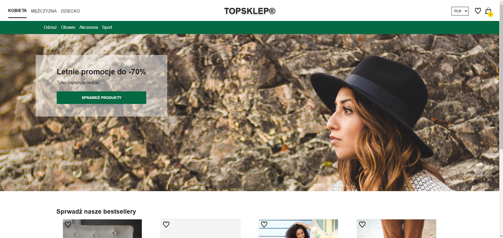
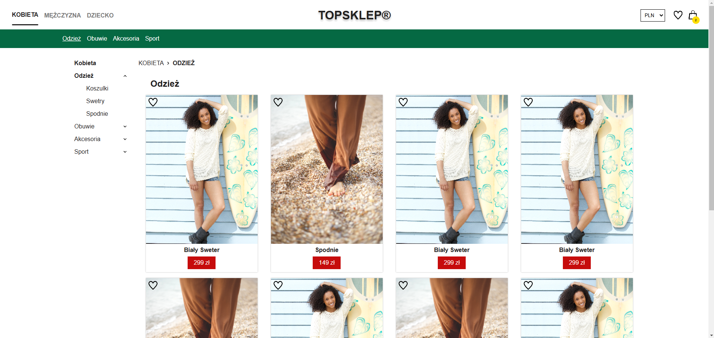

# Top shop

Demo E-commerce site created in react and json server. This is the final project of the [zrozumieć-react.pl](https://zrozumiecreact.pl/) course. Detailed descriptions of the application can be found in the front-end and back-end folders.
 
## Demo

<b>WARNING! The backend server is running on a free version of Render web service so the landing time of the site and images may be longer please be patient. (You can open this website and during page load you can check my other projects :)</b>
<br><br>
https://top-shop-szafter12.netlify.app/kobieta

## Run Locally

Clone the project

```bash
  git clone https://github.com/Szafter12/Top-shop.git
```

Go to the project directory

```bash
  cd Top-shop
```

Install dependencies

```bash
  npm install
```

Start the server

```bash
  npm run dev
```

## Screenshots




## Features

- Adding/removing product to/from the cart and save cart to localStorage
- Adding/removing products to/from favourities and save it to database
- Responsive design 
- Counting items in cart 
- Breadcrumbs
- Currency change
- products in cart have quantity 
- Pagination 
- Different views for each gender
- Zooming in on a product image
- scalable code 
- popup on adding items to cart/favourites 

## Incoming changes

- improve accessibility
- better images
- replace json server on a PHP or Golang backend 

## Tech Stack

- React
- JSON server
- Vite

## Authors

- [@Jakub Pachut](https://github.com/Szafter12)
