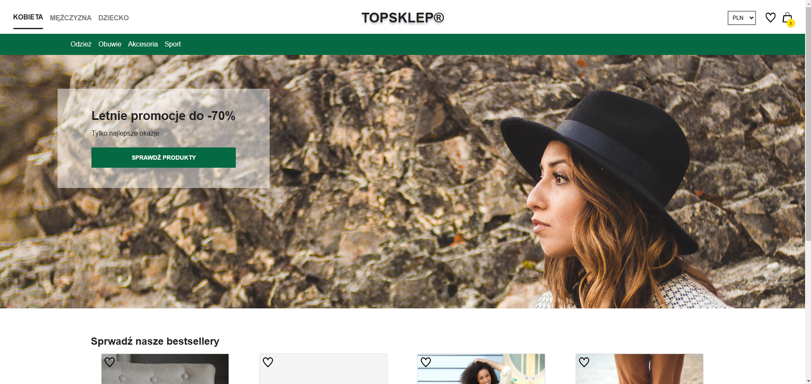
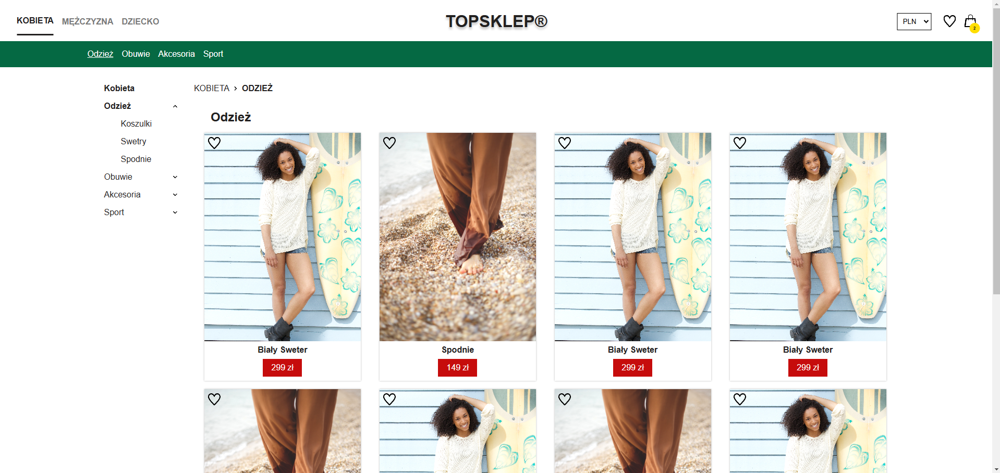

# Top shop

Demo E-commerce site created in react and json server. This is the final project of the [zrozumieć-react.pl](https://zrozumiecreact.pl/) course. Detailed descriptions of the application can be found in the front-end and back-end folders. 
The server is running on a free version of Render so the landing time of the images may be longer. 
## Demo

https://top-shop-szafter12.netlify.app/kobieta

## Run Locally

Clone the project

```bash
  git clone https://github.com/Szafter12/Top-shop.git
```

Go to the project directory

```bash
  cd Top-shop
```

Install dependencies

```bash
  npm install
```

Start the server

```bash
  npm run dev
```

## Screenshots




## Features

- Adding/removing product to/from the cart and save cart to localStorage
- Adding/removing products to/from favourities and save it to database
- Responsive design 
- Counting items in cart 
- Breadcrumbs
- Currency change 
- Pagination 
- Different views for each gender
- Zooming in on a product image
- scalable code 

## Incoming changes

- improve accessibility
- improve UX such as popup on adding items to cart/fav 
- better images
- products in cart has a intity
- replace json server on a PHP or Golang backend 

## Tech Stack

- React
- JSON server
- Vite

## Authors

- [@Jakub Pachut](https://github.com/Szafter12)
