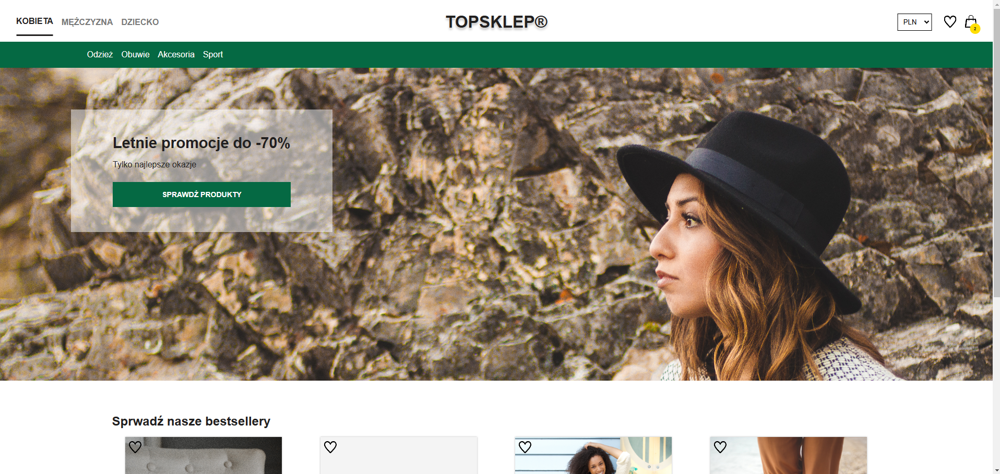
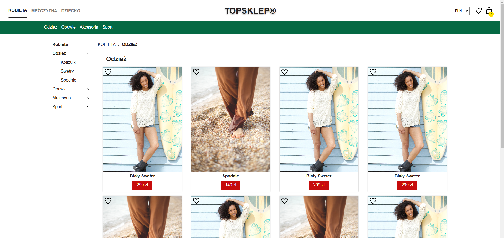

# Top Shop
A Feature-Rich E-commerce Demo built with React.

### What the project is
Top Shop is a modern e-commerce platform demo that simulates a real-world shopping experience. It utilizes a decoupled architecture with a **React** frontend and a **JSON Server** backend to manage product data, categories, and user preferences.

### Aim
The primary aim of this project was to complete the **[zrozumieć-react.pl](https://zrozumiecreact.pl/)** final course module. It focuses on mastering state management, handling side effects with **localStorage**, implementing complex UI patterns like breadcrumbs and pagination, and ensuring the code remains scalable and maintainable.

### Key Features
*   **Dynamic Cart System:** Add or remove items, manage quantities, and persist the cart state using `localStorage`.
*   **Favorites Management:** Save preferred products to a persistent database.
*   **Interactive UI:** Includes image zooming, breadcrumb navigation, and real-time popups for user actions.
*   **E-commerce Logic:** Integrated pagination, currency switching, and gender-specific product views.
*   **Responsive Design:** Fully optimized for mobile, tablet, and desktop devices.

### Challenges you faced and how you solved them
*   **Data Persistence:** Ensuring the user's cart isn't lost after a page refresh without hitting the API constantly.
    *   **Solution:** Implemented a synchronization layer between the React state and `localStorage`, allowing for instant UI updates while keeping data safe.
*   **Asynchronous State:** Managing the delay between user actions and backend updates (especially on free hosting).
    *   **Solution:** Added loading states and optimistic UI updates (popups) to provide immediate feedback to the user while the server processes requests.

### Setup or usage instructions

1. **Clone the project:**
```bash
git clone [https://github.com/Szafter12/Top-shop.git](https://github.com/Szafter12/Top-shop.git)
cd Top-shop
```
2. **Install dependencies:**
```bash
npm install
```
3. **Start the development server:**
```bash
npm run dev
```
4. **Live Demo:**
- Visit the hosted version here: Top Shop Demo
- Note: The backend is hosted on a free tier; please allow extra time for the initial spin-up.

### Technical concepts used
- React (Vite): Fast, modern frontend development and bundling.
- State Management: Handling complex object arrays (cart/favorites) across the application.
- Persistence: Utilizing localStorage for client-side data retention.
- Scalable Architecture: Modular component structure for easy feature expansion.

### Images/video demos


